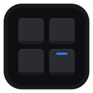
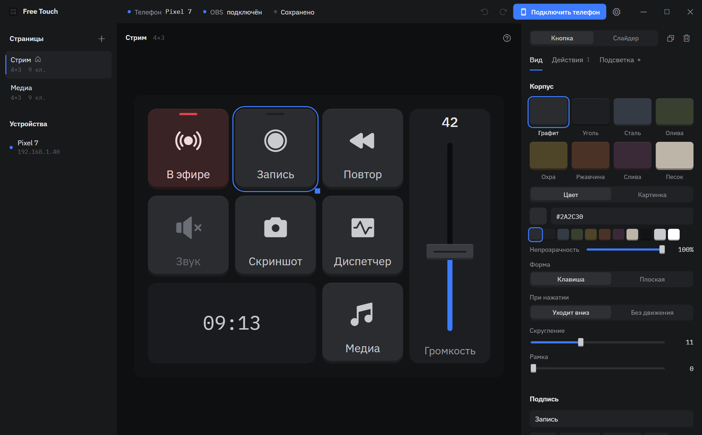
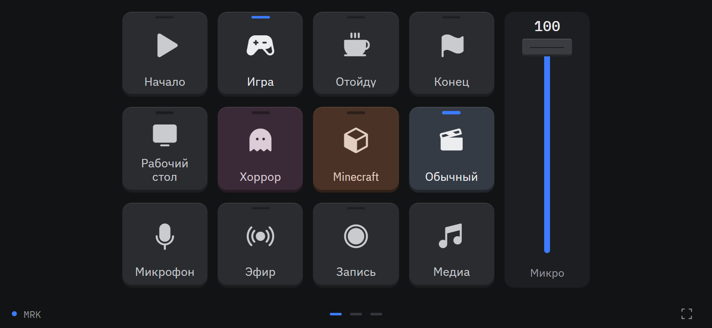

<p align="center">
  
</p>

<h1 align="center">Free Touch</h1>

<p align="center">
  Бесплатный пульт для ПК с телефона. Замена Touch Portal и Stream Deck без подписок, ограничений и рекламы.<br/>
  <sub>Free, open-source macro deck: control your Windows PC and OBS from your phone.</sub>
</p>

<p align="center">
  
</p>
<p align="center">
  
</p>

## Что умеет

- **Телефон подключается по QR-коду.** Пульт открывается в браузере телефона, ставить ничего не нужно. Можно добавить значок на главный экран, тогда пульт открывается на весь экран. Работает на Android и iPhone.
- **Страниц и кнопок сколько угодно.** Сетка до 12×10, кнопки можно растягивать на несколько ячеек.
- **OBS Studio.** Смена сцен и коллекций сцен, запуск стрима, записи и буфера повтора, виртуальная камера, выключение микрофона и других входов, показ и скрытие источников, слайдеры громкости входов. Порт и пароль OBS программа находит сама.
- **Состояния на клавишах.** Светодиод загорается у сцены в эфире, красный — только когда идёт стрим или запись, выключенный микрофон гаснет. Работает, даже если переключать всё в самом OBS.
- **Windows.** Сочетания клавиш (с удержанием — для рации в играх), запуск программ, файлов и сайтов, ввод текста, медиаклавиши, команды.
- **Громкость.** Общая громкость и громкость отдельных программ (Discord, игра, браузер) — кнопками и слайдерами.
- **Надписи с данными:** `{time}`, `{obs.scene}`, `{system.cpu}`, `{system.volume}` и любые другие состояния.
- **Клавиши как у железа.** Матовый пластик с объёмом, светодиод состояния, 8 цветов корпуса или свой цвет, картинки и GIF, 1500 значков Phosphor, логотипы брендов, эмодзи, три начертания IBM Plex.
- **Цепочки действий** с паузами: одна кнопка может сменить сцену, выключить микрофон и запустить запись.
- **Долгое нажатие.** На одной кнопке два действия: коротко и если подержать.
- **Экран телефона не гаснет,** пока открыт пульт.
- **Автообновление.** Программа сама находит новую версию на GitHub, показывает, что нового, и обновляется в один клик.
- **Профили.** Пульт сохраняется в один файл, им можно поделиться.

## Установка

1. Скачайте `Free.Touch_x.y.z_x64-setup.exe` со страницы [Releases](../../releases) и установите.
2. Откройте Free Touch и нажмите **«Подключить телефон»**.
3. Отсканируйте QR-код телефоном, подключённым к той же Wi-Fi.

При первом запуске Windows спросит разрешение для сети. Разрешите доступ для частных сетей, иначе телефон не увидит компьютер.

### OBS

В OBS включите **Сервис → Настройки WebSocket-сервера → Включить WebSocket-сервер**. Остальное Free Touch настроит сам.

## Сборка из исходников

Нужны [Node.js 20+](https://nodejs.org) и [Rust](https://rustup.rs).

```bash
npm install
npm run tauri dev      # запуск в режиме разработки
npm run tauri build    # установщик в src-tauri/target/release/bundle
```

Устройство проекта:

| Папка | Что внутри |
|---|---|
| `src-tauri/` | Программа на Rust: сервер для телефонов (HTTP + WebSocket), клавиатура, громкость, OBS |
| `src/` | Редактор пульта (React) |
| `panel/` | Пульт для телефона (React), вшивается в программу |
| `shared/` | Общая модель данных и отрисовка кнопок — редактор показывает кнопки точно как телефон |

## Выпуск новой версии

1. Опишите изменения в `CHANGELOG.md` в разделе `## x.y.z` — этот текст увидят пользователи в окне обновления.
2. `npm run release x.y.z -- --push` — версия поменяется во всех файлах, появится тег, GitHub Actions соберёт и опубликует релиз.
3. Установленные программы найдут обновление при следующем запуске (или через «Настройки → Проверить сейчас»).

Обновления подписываются. В секретах репозитория должен лежать `TAURI_SIGNING_PRIVATE_KEY` — закрытый ключ из `~/.tauri/free-touch.key` (пароль пустой). Без него сборка не пройдёт, а без правильной подписи программа обновление не установит.

## Планы

- Приложение для Android с поиском ПК в сети и подключением по USB
- Логика: переменные, условия, события
- Плагины и совместимость с плагинами Touch Portal
- Twitch, Spotify, Discord
- Английский интерфейс

## Лицензия

[MIT](LICENSE). Логотипы брендов — [Simple Icons](https://simpleicons.org) (CC0), значки — [Phosphor](https://phosphoricons.com) (MIT), шрифты — [IBM Plex](https://github.com/IBM/plex) (OFL).
